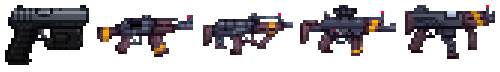

:::note
This guide is an early work-in-progress. Submit edits via the [Github repo](https://github.com/WreakHavocOnTheMiddleClass/ncwl-docs/).
:::

import { Tabs, TabItem } from '@astrojs/starlight/components';

<Tabs>

  <TabItem label="Ships" icon="information">

  ## Ships

  :::caution
  If you're reading this introductory guide, you should (most likely) not buy your own ship. Your officers and fellow workers should have ships available for you to crew and train on.
  :::

  ### Piloting

  Interact with the Shuttle Console to bring up the piloting UI. Ensure your ship is undocked before you attempt to move it. Use WASD for forward/reverse/strafe, Q/E for rotation, and spacebar for brake.

  

  #### Modules

  **Module** buttons, if available, can trigger a variety of ship systems such as weapons and blast doors. **Check the shipyard entry for your ship before interacting with these modules;** failure to do so may result in misfired weapons or other unintended consequences.

  ### Weaponry

  #### Mount Types

  Hardpoints (or fixedpoints) are weapons built into your ship's hull. They cannot turn or rotate, but are generally more powerful than turrets. These weapons can be fired using the module buttons on the **Shuttle Console**.

  Turrets can rotate to follow targets. **If turrets are armed, they will automatically fire on any ship belonging to a hostile faction.** These weapons can be fired using the **Gunnery Console** by clicking a position in space to fire at; any selected turrets capable of firing in that direction will fire.

  #### Weapon Types 

  Ballistic weapons (such as machine guns and cannons) are most effective against hull.

  Laser weapons pass through hull but do minimal structural damage and are intended to damage crew, except for plasma bolts which explode on the hull and spread radiation around the area.

  Missiles create large explosions on impact, perfect for fighting large targets, but may have limited ammunition.

  #### Loading

  Most ship weapons need to be reloaded. To do so, click on the weapon while holding the appropriate ammunition. This may be an individual shell or a magazine of multiple rounds of ammunition (which must first be loaded with those rounds). There may be multiple types of ammunition available such as **high-yield explosive**, **uranium**, **EMP**, or **practice** rounds.
    
  </TabItem>
  <TabItem label="Infantry" icon="information">

  ## Combat

  *For general SS14 combat mechanics, see [the wiki guide](https://wiki.spacestation14.com/wiki/Combat) or [this explainer video](https://www.youtube.com/watch?v=c35R3mMz21Q).*

  ### Weapons

  Weapons may be purchased from a vendor, crafted at a microforge, or found in the armories of certain ships and stations.

  

  **NCWL .45 T-45**: The T-45 is a powerful and surprisingly quick semi-automatic magnum handgun, favored by the NCWL for its ability to deliver the hard hitting .45 cartridge with remarkable speed. This handgun can dispatch opponents with efficiency, making it an exceptional choice for field operations. It's particularly valued by officers, who frequently rely on it to enforce discipline.

  **NCWL 7.62 (.308 Batyana)**: The NCWL Batyana is a specialized Kalashnikov platform rifle known for its hard-hitting performance, despite being one of the slower firing guns in the arsenal. It fires at a steady pace, offering consistent power and reliability to the infantry. While it might lack the rapid fire rate of other weapons.

  **NCWL 9x9mm Liberator**: A cut-down and lightened version of the Batyana, the NCWL Liberator SMG offers a faster fire rate while maintaining steady accuracy. Its bullet dispersion is impressively tight, making it ideal for holding corners and engaging in defensive combat. The Liberator excels in close-quarters, where its compact design and rapid firing can turn the tide of a skirmish.

  **NCWL 5.56 (.20 FAL)**: The most advanced rifle in the NCWL arsenal, the 5.56 FAL is a select-fire weapon designed for versatility and precision. It fires at a steady pace with minimal dispersion, making it an excellent complement to the Batyana. The FAL’s balanced performance and adaptability.

  **NCWL Watchdog 9x9mm**: The NCWL Watchdog is an even shorter and lighter SMG, akin to the 74u, and boasts the highest fire rate in the entire NCWL arsenal. This weapon is terrifying in close quarters combat, especially in tight spaces where volume of fire is crucial. Primarily used by boarders and skirmishers, the Watchdog is perfect for those who need to unleash a barrage of bullets quickly, though its control can be a bit tricky due to its intense fire rate.

  </TabItem>

  <TabItem label="Trading" icon="information">

  ## Trading / Cargo Hauling

  Various trade goods can be purchased at one station and then sold for a profit at other stations. Available trading partners vary depending on the NCWL's relationship with other factions.

  1. Get a cargo hauler or any ship large enough to fit your desired number of **crates**.

  2. Go to any station with a cargo hold. In the cargo department, locate a machine called the **dispensary**, where you can buy different types of cargo crates. Keep in mind each type of crate may be worth more or less to one station or another.

  3. Once you have obtained your desired crates, go to a different station with a turn-in point. At the turn-in point, insert the crate (click the turn-in point using the same hand dragging the crate) and it will dispense a **deed**.

  4. Go to a **deed console** to turn in the deeds for a credit chip of equivalent value. The station also receives a small amount of money as an incentive to promote trading. Deposit your credit chips at an ATM.
  </TabItem>
</Tabs>