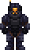
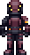
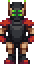
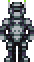
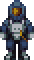

*For general SS14 combat mechanics, see [the wiki guide](https://wiki.spacestation14.com/wiki/Combat) or [this explainer video](https://www.youtube.com/watch?v=c35R3mMz21Q).*

## Suits

Each faction's EVA suits, hardsuits, and armor follow a general color scheme. Being able to quickly identify the allegiance of a particular hardsuit may mean the difference between life and death.

EVA suits offer protection from the depressurized environment of space, but little else. Hardsuits offer varying degrees of protection from other sources of harm as well as depressurization. Armor tends to offer greater protection against projectiles but no protection against depressurization.

Below is a non-exhaustive visual reference of suits from various factions.

| | | | |
| --- | --- | --- | --- | 
| | | | |
| NCWL |  |  |  |
| DSM |  |  | |
| TFSC |  |  | |
| CMM |  |  | |
| | | | |

## Weapons

Weapons may be purchased from a vendor, crafted at a microforge, or found in the armories of certain ships and stations.