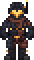
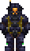
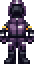
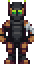
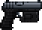
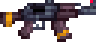
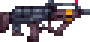
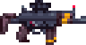
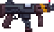

:::caution
This section is outdated. Consider editing this page to update the weapon and faction information.
:::

## Combat

*For general SS14 combat mechanics, see [the wiki guide](https://wiki.spacestation14.com/wiki/Combat) or [this explainer video](https://www.youtube.com/watch?v=c35R3mMz21Q).*

### Suits

Each faction's EVA suits, hardsuits, and armor follow a general color scheme. Being able to quickly identify the allegiance of a particular hardsuit may mean the difference between life and death.

EVA suits offer protection from the depressurized environment of space, but little else. Hardsuits offer varying degrees of protection from depressurization, projectiles, fire, and radiation. Armor may offer greater protection against projectiles but no protection against depressurization.

Below is a non-exhaustive visual reference of suits from various factions.

| Faction | | | |
| --- | --- | --- | --- | 
| New Crescent Worker's League |  | |  |
| Divine Sol Mandate | | |  |
| Taypan Free Stations Coalition | | |  |

### Weapons

Weapons may be purchased from a vendor, crafted at a microforge, or found in the armories of certain ships and stations.

| Name | Description |
| --- | --- |
| **NCWL .45 T-45**    | The T-45 is a powerful and surprisingly quick semi-automatic magnum handgun, favored by the NCWL for its ability to deliver the hard hitting .45 cartridge with remarkable speed. This handgun can dispatch opponents with efficiency, making it an exceptional choice for field operations. It's particularly valued by officers, who frequently rely on it to enforce discipline. |
| **NCWL 7.62 (.308 Batyana)**    | The NCWL Batyana is a specialized Kalashnikov platform rifle known for its hard-hitting performance, despite being one of the slower firing guns in the arsenal. It fires at a steady pace, offering consistent power and reliability to the infantry. While it might lack the rapid fire rate of other weapons. |
| **NCWL 9x9mm Liberator**    | A cut-down and lightened version of the Batyana, the NCWL Liberator SMG offers a faster fire rate while maintaining steady accuracy. Its bullet dispersion is impressively tight, making it ideal for holding corners and engaging in defensive combat. The Liberator excels in close-quarters, where its compact design and rapid firing can turn the tide of a skirmish. |
| **NCWL 5.56 (.20 FAL)**    | The most advanced rifle in the NCWL arsenal, the 5.56 FAL is a select-fire weapon designed for versatility and precision. It fires at a steady pace with minimal dispersion, making it an excellent complement to the Batyana. The FAL’s balanced performance and adaptability. |
| **NCWL Watchdog 9x9mm**    | The NCWL Watchdog is an even shorter and lighter SMG, akin to the 74u, and boasts the highest fire rate in the entire NCWL arsenal. This weapon is terrifying in close quarters combat, especially in tight spaces where volume of fire is crucial. Primarily used by boarders and skirmishers, the Watchdog is perfect for those who need to unleash a barrage of bullets quickly, though its control can be a bit tricky due to its intense fire rate. |